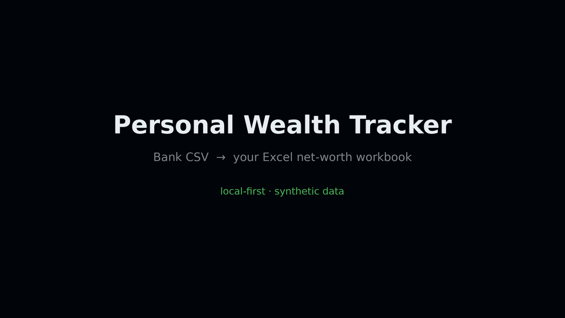
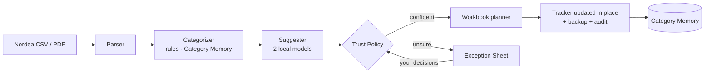

<div align="center">

# 💰 PersonalWorthTracker

**Turn your monthly bank export into an up-to-date Excel net-worth tracker — without your data ever leaving your machine.**


<a href="docs/assets/demo.mp4">
  
</a>

<sub>30-second demo on synthetic data · <a href="docs/assets/demo.mp4">MP4</a> · regenerate with <code>scripts/record_demo.py</code></sub>

</div>

---

## Why

Keeping a personal net-worth spreadsheet is great. Updating it every month is not: export the statement, sort 80 transactions into categories, type totals into the right cells, don't break the formulas.

`wealth-tracker` does the boring 95% and hands you **only the rows it isn't sure about**.

```text
Nordea CSV ──▶ rules + memory + local LLMs ──▶ Trust Policy ──┬─▶ auto-accepted ──▶ copy of your workbook ✅
                                                               └─▶ Exception Sheet ─▶ you decide ─▶ re-run
```

## Features

- 🔒 **Local-first.** No cloud, no bank API, no telemetry. Statements, workbooks and reports are git-ignored by default.
- 🧾 **One workbook, every month.** Each commit updates `Net Worth Tracker.xlsx` in place after a timestamped backup in `data/backups/`, so months accumulate. Formulas, fixed rows and cells you edited are never overwritten.
- 🧠 **Learns from you.** Committed decisions become Category Memory, so next month's repeat merchants categorise themselves.
- 🤝 **Two-model consensus (optional).** Two local Ollama models vote; a row is auto-accepted only when both agree, the amount is small, and the category isn't flagged never-auto. Prompts are minimised (merchant, amount, date) and never leave your machine.
- 📋 **One Exception Sheet.** Uncertain rows land in a single `.xlsx`: leave blank to accept the suggestion, type `NONE` to reject, or pick a category from the dropdown.
- ⚛️ **Atomic month commit.** Nothing is written while any row is still in review. All or nothing.
- 🔍 **Full audit trail.** Markdown report, categorised CSV and JSONL audit log for every run.

## Quick start

```bash
git clone https://github.com/EricleungDK/personalwealthtracker.git
cd personalwealthtracker
uv sync --extra dev

# 1. create a workspace with a synthetic template + sample statement
uv run wealth-tracker setup --workspace my-wealth
cd my-wealth
cp templates/local-wealth-tracker-template.xlsx "Net Worth Tracker.xlsx"
cp examples/synthetic-nordea-transactions.csv data/raw_statements/

# 2. run the month
uv run wealth-tracker monthly            # add --dry-run to preview only
```

If anything needs you, open `reports/review_required_<year>_<mon>.xlsx`, save it, and run `monthly` again. When `Rows in review: 0`, the month is committed.

> **Using your own data:** swap in your real tracker as `Net Worth Tracker.xlsx` and drop the Nordea CSV export into `data/raw_statements/`. Both paths are git-ignored.

### Optional: local LLM suggestions

Install [Ollama](https://ollama.com) and pull the models in [`config/settings.yaml`](config/settings.yaml) (`gemma4:26b`, `gemma4:12b`, fallback `qwen3:14b`). `monthly` uses them automatically when running; on single-statement runs pass `--local-llm-suggestions` for local Ollama/Gemma review suggestions. No model running? Everything still works; unmatched rows simply go to the Exception Sheet.

## How it works



Design decisions are recorded as ADRs in [`docs/adr/`](docs/adr/) — e.g. [blank means accept](docs/adr/0003-blank-means-accept-atomic-month-commit.md) and [local two-model consensus](docs/adr/0002-local-two-model-consensus.md).

## Commands

| Command | What it does |
| --- | --- |
| `wealth-tracker setup` | Create a workspace: config, synthetic Template Workbook, sample statement |
| `wealth-tracker monthly` | Categorise the newest statement; commit or write the Exception Sheet |
| `wealth-tracker --statement … --year … --month …` | Single-statement dry run (`--commit` to write) |
| `wealth-tracker import-statement` | Turn an unknown bank format into a review-only import |
| `wealth-tracker importer-profile learn` | Learn a private Importer Profile from a reviewed import |
| `wealth-tracker template-workbook customize` | Rename labels / currency in the Template Workbook |

Every flag and output: **[docs/cli_reference.md](docs/cli_reference.md)**.

## Privacy

This handles real finances, so the defaults are paranoid:

- Real statements, workbooks, reports, backups, memory and `*.local.yaml` rules are all in `.gitignore`.
- Tests use only synthetic or redacted fixtures.
- Private merchant rules live in ignored `config/rules.local.yaml` (start from `rules.local.example.yaml`).

The full public/private boundary: [docs/public_private_boundary.md](docs/public_private_boundary.md).

## Docs

| | |
| --- | --- |
| [Monthly workflow](docs/monthly_workflow.md) | Month-end operator checklist |
| [CLI reference](docs/cli_reference.md) | All commands, flags and outputs |
| [Project overview](docs/project_overview.md) | Plain-language map with diagrams |
| [Public Package Workflow](docs/public_package_workflow.md) | Setup, imports, learning, commit-to-copy |
| [Template Workbook](docs/template_workbook.md) | The synthetic workbook contract |
| [ADRs](docs/adr/) | Why things are the way they are |

## Roadmap

- [x] Nordea CSV + PDF parsing
- [x] Category Memory, Exception Sheet, atomic month commit
- [x] Local two-model consensus
- [ ] Investment statements as month-end asset evidence
- [ ] More banks via Importer Profiles
- [ ] Scheduler / watched folder

## Development

```bash
uv run pytest                              # full suite
.venv/bin/python scripts/record_demo.py    # re-render the demo from a real synthetic run
```

Built test-first. Contributions welcome — keep fixtures synthetic.
