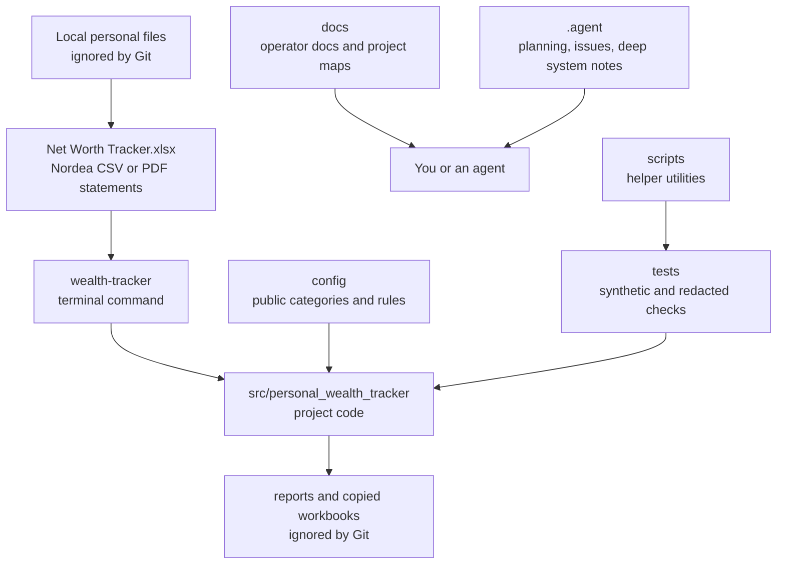
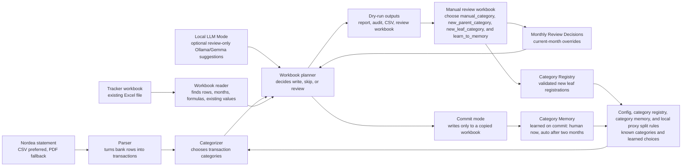
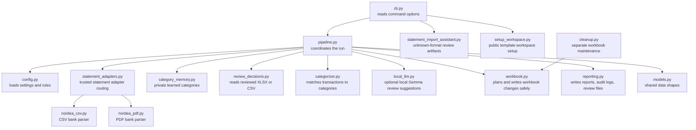
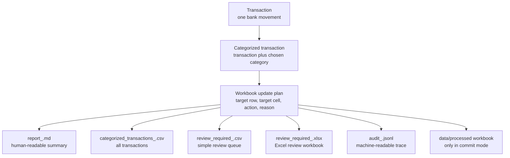
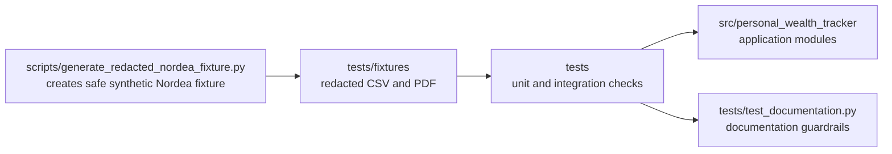

# Project Overview

This page is the non-technical map of PersonalWorthTracker. It explains what lives where, how a monthly run moves through the project, and which files are scripts, components, or documentation.

For the step-by-step monthly checklist, use [monthly_workflow.md](monthly_workflow.md). For the public setup, synthetic examples, adapter contracts, and v1 non-goals, use [docs/public_package_workflow.md](public_package_workflow.md), the Public Package Workflow.

## What The Project Does

PersonalWorthTracker is a local command-line helper for updating a personal Excel wealth tracker. It reads a Nordea bank statement, classifies the transactions, checks the tracker workbook for safe target cells, and writes review outputs before anything is committed to a copied workbook.

The original tracker workbook, real bank statements, generated reports, category memory, backups, and processed workbooks stay local and ignored by Git.

The future public package boundary is tracked in [public_private_boundary.md](public_private_boundary.md): reusable code, docs, sample config, and synthetic fixtures can ship publicly; real statements, tracker workbooks, generated outputs, Category Memory, Importer Profiles, local rules, proxy split rules, and local profile files stay private.

The versioned synthetic Template Workbook contract is documented in [docs/template_workbook.md](template_workbook.md). It defines the public `local-wealth-tracker-template` metadata, generic workbook structure, and v1 customization boundary.

The guided setup entry point is `wealth-tracker setup`. It creates a local workspace with generic config, a private local profile file, ignored data/report directories, the synthetic Template Workbook, and a synthetic Nordea CSV example that can exercise a dry run without real financial data.

Supported template customization uses `wealth-tracker template-workbook customize` for known v1 dimensions: category labels, section labels, Tracker Currency, setup profile paths, and period columns created by the workbook planner. Unsupported formula changes and arbitrary layout edits are rejected or reported as unsupported.

## Project Map

Read this diagram as:

- `Local personal files` are your real finance files. They are useful for running the tool, but should not be committed.
- `src/personal_wealth_tracker` is where the application logic lives.
- `config` contains committed shared rules; private merchant-specific rules and proxy split rules belong in ignored local files such as `rules.local.yaml`.
- `docs` is the user-facing place to understand and operate the project.
- `.agent` is the working memory and issue tracker for coding agents.

## Monthly Run Flow

The important split is:

- Dry run means plan and report only.
- Monthly Review Decisions fix specific transactions for the selected month.
- The Category Registry in `config/categories.yaml` defines Parent/Section Row labels, Leaf Category Row labels, derived rows, aliases, and where missing leaf categories may be added.
- Category Memory learns committed decisions (`human`) and consensus results (`auto`, trusted after two committed months) for future months.
- Proxy Split Transfer rules in ignored `rules.local.yaml` can split one intermediary transfer into fixed allocation lines plus an optional Residual Review Line.
- Local LLM Mode: optional `--local-llm-suggestions` review assistance using local Ollama/Gemma; suggestions stay review-only and reuse existing review workbook suggestion fields.
- Commit mode writes only safe values into a copied workbook under `data/processed/`.

## Main Components

Plain-language component roles:

- `cli.py` is the front door. It turns terminal options into a command.
- `pipeline.py` is the coordinator. It decides which step runs next.
- `statement_adapters.py` routes trusted known statement formats and records import diagnostics.
- `statement_import_assistant.py` creates untrusted review artifacts for unknown statement formats.
- `setup_workspace.py` creates a public-template local workspace with generic config, local profile paths, and synthetic examples.
- `nordea_csv.py` and `nordea_pdf.py` turn known Nordea bank files into transaction records.
- `categorizer.py` decides what each transaction probably is.
- `review_decisions.py` applies your reviewed Excel decisions by exact transaction ID.
- `category_memory.py` stores future learned category choices in ignored local data.
- `local_llm.py` talks to Ollama's local HTTP API when `--local-llm-suggestions` is enabled and keeps model output review-only.
- `workbook.py` protects the tracker workbook from unsafe writes.
- `reporting.py` produces the files you inspect after a dry run.
- `cleanup.py` is for separate workbook maintenance tasks, not monthly transaction updates.

## Outputs And Decision Files

Use the files this way:

- Start with the Markdown report to understand the run quality and planned workbook changes.
- Use `review_required_<period>.xlsx` when you need to manually classify transactions.
- Use `Audit` inside the review workbook to spot-check `auto` rows (source, votes, reason).
- `Category Options`, `Decision Options` and `Run Metadata` are hidden helper sheets (dropdown lists, run period); unhide them only to inspect workbook fields and safety notes.
- Use the audit log only when you need a detailed machine-readable trace.

## Scripts And Tests

The script is not part of the monthly operator workflow. It exists so tests can cover Nordea parsing without committing real bank statements.

## Documentation Map

- [public_package_workflow.md](public_package_workflow.md) - Public Package Workflow for setup, synthetic examples, statement imports, learning, and commit-to-copy usage.
- [monthly_workflow.md](monthly_workflow.md) - monthly operator checklist.
- [public_private_boundary.md](public_private_boundary.md) - public package versus private profile boundary.
- [template_workbook.md](template_workbook.md) - versioned synthetic Template Workbook contract.
- [README.md](../README.md) - setup commands, privacy rules, dry-run and commit examples.
- [.agent/System/architecture.md](../.agent/System/architecture.md) - deeper technical architecture notes.
- [.agent/System/domain_language.md](../.agent/System/domain_language.md) - project vocabulary used by agents.
- [.agent/System/data_contracts.md](../.agent/System/data_contracts.md) - expected data shapes and safety contracts.
- [.agent/issues/kanban.md](../.agent/issues/kanban.md) - local issue tracker.

## Glossary

- CLI: Command-line interface. The `wealth-tracker` command you run in the terminal.
- Parser: Code that turns a bank statement file into structured transactions.
- Transaction: One bank movement from a statement.
- Category: The tracker workbook row a transaction belongs to.
- Parent/Section Row: A workbook row such as `Living expenses`, `Services`, or `Insurance` that groups or totals child rows and is not a valid transaction category target.
- Leaf Category Row: A workbook row under a parent section that can receive source-backed transaction totals, manual review decisions, and Category Memory learning.
- Category Registry: The YAML category source in `config/categories.yaml` that records parent, leaf, derived, alias, and allowed-new-child rules.
- Dry run: A run that plans and reports but does not write workbook values.
- Commit mode: A run with `--commit`; it writes eligible values only to a copied workbook.
- Review workbook: The Excel file where you choose `manual_category` for existing leaf rows, `new_parent_category` and `new_leaf_category` for missing leaf rows, and optional `learn_to_memory`.
- Monthly Review Decisions: Current-month manual choices applied by exact transaction ID.
- Category Memory: Private learned merchant/category choices for future runs.
- Local LLM Mode: Explicit opt-in `--local-llm-suggestions` mode that can add review-only local Ollama/Gemma hints to unmatched or low-confidence rows.
- LLM Category Suggestion: A model hint shown in the existing `suggested_category`, `confidence`, and `reason` fields (the method is appended to `reason` in brackets); it is not a confirmed decision.
- LLM New Leaf Candidate: A model hint that a missing leaf row may be needed. It does not fill `new_parent_category` or `new_leaf_category` for you.
- Statement Import Assistant: A review-only path for unknown statement formats. It writes untrusted import review artifacts and does not feed monthly planning until a later confirmed-import workflow exists.
- Importer Profile: Private local JSON learned from confirmed unknown-import review rows. It can produce filterable Educated Import Guesses for similar future sources and is exported only by explicit command.
- Educated Import Guess: A review-only suggested field mapping or category from a local Importer Profile, shown with `guess_state`, `guess_confidence`, `guess_reason`, and `guess_profile`.
- Proxy Split Transfer: One intermediary bank transfer split into explicit tracker allocation lines while preserving the source transaction for audit.
- Residual Review Line: The leftover amount from a larger proxy split transfer; it is reviewed for the current month and not learned into Category Memory.
- Fixed row: A workbook row the automation must not overwrite.
- Formula-owned row: A workbook row controlled by Excel formulas.
- Audit log: A detailed machine-readable record of what happened.
- Mermaid: A text format for diagrams inside Markdown.
