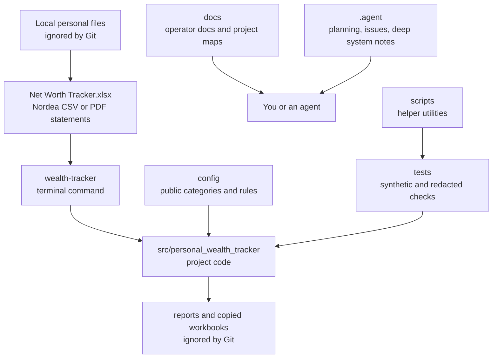
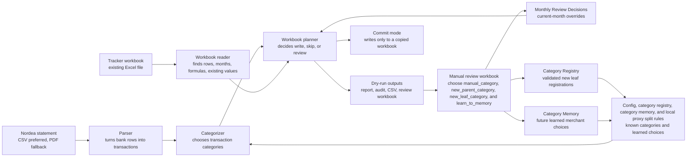
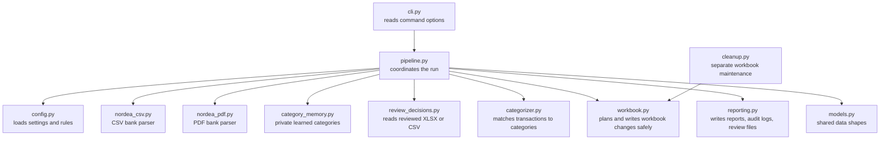
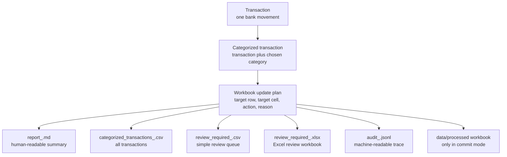
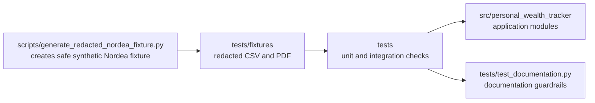

# Project Overview

This page is the non-technical map of PersonalWorthTracker. It explains what lives where, how a monthly run moves through the project, and which files are scripts, components, or documentation.

For the step-by-step monthly checklist, use [monthly_workflow.md](monthly_workflow.md).

## What The Project Does

PersonalWorthTracker is a local command-line helper for updating a personal Excel wealth tracker. It reads a Nordea bank statement, classifies the transactions, checks the tracker workbook for safe target cells, and writes review outputs before anything is committed to a copied workbook.

The original tracker workbook, real bank statements, generated reports, category memory, backups, and processed workbooks stay local and ignored by Git.

## Project Map

Read this diagram as:

- `Local personal files` are your real finance files. They are useful for running the tool, but should not be committed.
- `src/personal_wealth_tracker` is where the application logic lives.
- `config` contains committed shared rules; private merchant-specific rules and proxy split rules belong in ignored local files such as `rules.local.yaml`.
- `docs` is the user-facing place to understand and operate the project.
- `.agent` is the working memory and issue tracker for coding agents.

## Monthly Run Flow

The important split is:

- Dry run means plan and report only.
- Monthly Review Decisions fix specific transactions for the selected month.
- The Category Registry in `config/categories.yaml` defines Parent/Section Row labels, Leaf Category Row labels, derived rows, aliases, and where missing leaf categories may be added.
- Category Memory learns selected merchant choices for future months.
- Proxy Split Transfer rules in ignored `rules.local.yaml` can split one intermediary transfer into fixed allocation lines plus an optional Residual Review Line.
- Commit mode writes only safe values into a copied workbook under `data/processed/`.

## Main Components

Plain-language component roles:

- `cli.py` is the front door. It turns terminal options into a command.
- `pipeline.py` is the coordinator. It decides which step runs next.
- `nordea_csv.py` and `nordea_pdf.py` turn bank files into transaction records.
- `categorizer.py` decides what each transaction probably is.
- `review_decisions.py` applies your reviewed Excel decisions by exact transaction ID.
- `category_memory.py` stores future learned category choices in ignored local data.
- `workbook.py` protects the tracker workbook from unsafe writes.
- `reporting.py` produces the files you inspect after a dry run.
- `cleanup.py` is for separate workbook maintenance tasks, not monthly transaction updates.

## Outputs And Decision Files

Use the files this way:

- Start with the Markdown report to understand the run quality and planned workbook changes.
- Use `review_required_<period>.xlsx` when you need to manually classify transactions.
- Use `All Transactions` inside the review workbook to debug a low classification rate or low no-review rate.
- Use `Category Options` inside the review workbook to see workbook fields and safety notes.
- Use the audit log only when you need a detailed machine-readable trace.

## Scripts And Tests

The script is not part of the monthly operator workflow. It exists so tests can cover Nordea parsing without committing real bank statements.

## Documentation Map

- [monthly_workflow.md](monthly_workflow.md) - monthly operator checklist.
- [README.md](../README.md) - setup commands, privacy rules, dry-run and commit examples.
- [.agent/System/architecture.md](../.agent/System/architecture.md) - deeper technical architecture notes.
- [.agent/System/domain_language.md](../.agent/System/domain_language.md) - project vocabulary used by agents.
- [.agent/System/data_contracts.md](../.agent/System/data_contracts.md) - expected data shapes and safety contracts.
- [.agent/issues/kanban.md](../.agent/issues/kanban.md) - local issue tracker.

## Glossary

- CLI: Command-line interface. The `wealth-tracker` command you run in the terminal.
- Parser: Code that turns a bank statement file into structured transactions.
- Transaction: One bank movement from a statement.
- Category: The tracker workbook row a transaction belongs to.
- Parent/Section Row: A workbook row such as `Living expenses`, `Services`, or `Insurance` that groups or totals child rows and is not a valid transaction category target.
- Leaf Category Row: A workbook row under a parent section that can receive source-backed transaction totals, manual review decisions, and Category Memory learning.
- Category Registry: The YAML category source in `config/categories.yaml` that records parent, leaf, derived, alias, and allowed-new-child rules.
- Dry run: A run that plans and reports but does not write workbook values.
- Commit mode: A run with `--commit`; it writes eligible values only to a copied workbook.
- Review workbook: The Excel file where you choose `manual_category` for existing leaf rows, `new_parent_category` and `new_leaf_category` for missing leaf rows, and optional `learn_to_memory`.
- Monthly Review Decisions: Current-month manual choices applied by exact transaction ID.
- Category Memory: Private learned merchant/category choices for future runs.
- Proxy Split Transfer: One intermediary bank transfer split into explicit tracker allocation lines while preserving the source transaction for audit.
- Residual Review Line: The leftover amount from a larger proxy split transfer; it is reviewed for the current month and not learned into Category Memory.
- Fixed row: A workbook row the automation must not overwrite.
- Formula-owned row: A workbook row controlled by Excel formulas.
- Audit log: A detailed machine-readable record of what happened.
- Mermaid: A text format for diagrams inside Markdown.
